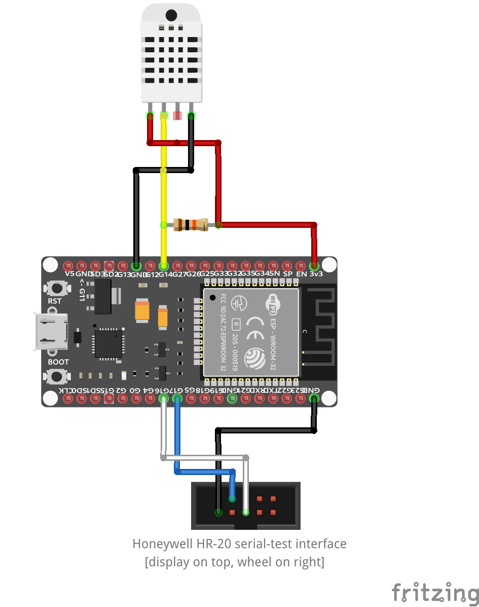

# Honeywell HR20 Controller

## About
This is a implementation to remote controll a Honeywell HR-20 radiator regulator in a 
[Home Assistant](https://www.home-assistant.io/) instance. 
To control the radiator over UART, an ESP Microcontroller is used. 
The communication between Home Assistant and the Microcontroller is done with the 
[ESPHome](https://esphome.io/) framework. 
Therefore an [ESPHome Custom Climate Component](https://esphome.io/components/climate/custom.html) was created, 
which will send/ receive the commands to/ from the Honeywell radiator regulator. 

This repository contains one implementation for the Honeywell HR-20 Hardware version 1 and 
another one for Hardware version 2 with [OpenHR20](https://github.com/OpenHR20/OpenHR20) firmware.
The implementation was tested with the NodeMCU v3 (ESP8266) and ESP32 as IoT getway to remote control the heater. 

The UART protocoll for Hardware version 1 was reengineered, to manipulate the memory 
over a programming/debugging UART interface ([protocol](http://symlink.dk/projects/rondo485/).
The protocoll for the OpenHR20 firmware can be found 
[here](https://www.mikrocontroller.net/articles/Heizungssteuerung_mit_Honeywell_HR20#UART_Protocoll)

**Here is a wiring example:**

## How to Use
1. Follow the instructions from [ESPHome](https://esphome.io/guides/getting_started_command_line.html) 
    how to setup the build & deploy toolchain on your host. 
   - Initial flashing must be done over wired USB connection. Afterwards it can be done OTA. 
2. Deploy the C++ header files from [include](./include/) and the ESPHome YAML [config](./config/livingroom.yaml) 
    to the shared config directory of the toolchain. 
    - When you run the ESPHome docker container, you also specify where this shared config directory shall be mounted. 
3. Open the ESPHome dashboard (usually http://localhost:6052/) and install the config from this project. 
4. Install ESPHome in your Home Assistant instance. 
Follow [this guide](https://esphome.io/guides/getting_started_hassio.html). 
5. Add the related ESPHome entities to your Home Assistant Dashboard. 

## Previous Version 
The inital version of this repository (git tag V1.0) was implemented to work with
[Legacy blynk.io](https://docs.blynk.io/en/blynk-1.0-and-2.0-comparison/migrate-from-1.0-to-2.0). 
With minor adaptations it should also work with the latest blynk version. 
However the blynk implementation of this project is discontinued and replaced by Home Assistant. 